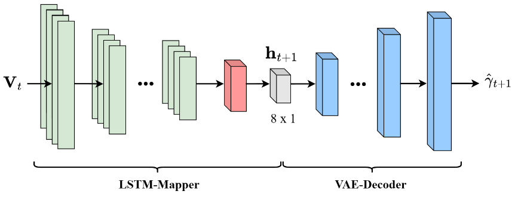
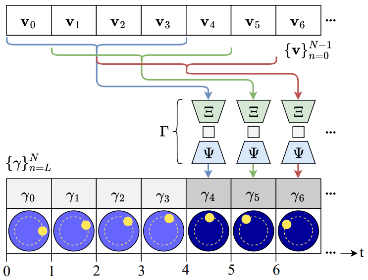

# Dynamic-object-trajectory-prediction-of-time-dependent-EIT-data-using-recurrent-neural-networks

This project presents a novel approach for dynamic image reconstruction of Electrical Impedance Tomography (EIT). This approach uses a data-driven reconstruction model consisting of a Variational Autoencoder (VAE) and a mapper with an integrated Long-Short-Term-Memory (LSTM) unit. The network has been specically designed for dynamic object trajectory prediction, allowing accurate tracking of an object's movement within the EIT tank and also predicting future object positions by exploiting temporal information in sequential EIT data. This approach was developed in both (2D and 3D) reconstructions of object motion. Data collection was performed using an EIT tank equipped with two electrode rings (each with 32 electrodes) and a Sciospec EIT device. In this project, the reconstruction network was trained and tested on synthetic data generated by FEM simulation (using pyEIT forward solver), experimental EIT data collected during 2D motion and experimental EIT data collected during 3D motion.

## Reconstruction network architecture

The reconstruction model consists of two core components: a mapper with an integrated LSTM layer at the output and a VAE decoder. The architecture is illustrated in figure 1.

  

  <em>Figure. 1: Architecture of reconstruction model.</em>

The LSTM mapper, denoted as $\Xi$, processes temporal sequences of voltage measurements and maps it to the latent space $\mathbf{h}$. Subsequently, the VAE decoder, denoted as $\Psi$, reconstructs the latent representation into a conductivity distribution. The complete reconstruction network $\Gamma$ is defined as the composition of these mapping processes:

$$
\Gamma := \Xi \circ \Psi : V_{t} \mapsto h_{t+1} \mapsto \hat{\gamma}_{t+1}
$$

Here, $\mathbf{V}$ represents the voltage measurements at time $t$, $\mathbf{h}$ is the predicted latent space representation, and $\hat{\gamma}_{t+1}$ is the reconstructed conductivity distribution at time $t+1$. Figure 2 illustrates the working principle of the reconstruction network, demonstration how a sequence of voltage measurements as input of the network is uswd to predict the future conductivity distribution.

  

  <em>Figure. 1: Overview of the reconstruction process of the proposed reconstruction model. A sequence of four voltage measurements is used to predict the conductivity distribution of the next time step.</em>

## Training of reconstruction network

The training process was conducted in two stages. In the first stage, the VAE was trained in an unsupervised using synthetically generated conductivity distributions for both 2D and 3D space.
For the 2D reconstructions, a triangular mesh representing the electrode plane of a cylindrical tank was used. For 3D reconstructions, a voxel-based approach was used.
In the second training stage, the LSTM mapper was trained in a supervised manner. The VAE encoder generated a latent representations of known conductity distributions, which served as labels for the supervised learning of the LSTM mapper. Sequences of voltage measurements $\mathbf{V}$ were paired with the corresponding latent representations of future conductivity distributions.

## EIT data collection

EIT data were acquired in both simulated and experimental settings. Simultions were performed using FEM-based modeling with the pyEIT package, while experimental data were collected using an EIT water tank. For 2D data, both FEM simulation and experimental measurements were conducted on a single electrode plane, yielding $32^2$ voltage data points per frame. For 3D data, experimental measurements with two electrode planes were performed, resulting in $64^2$ voltage data points per frame. The EIT data were collected by tracking an acrylic ball along predefined trajectories at discrete positions. In 2D space, a circular, spiral, eight, polynomial, square trajectory were used. In 3D space, the trajectories uses were a helix, a spiral helix and a circular sine wave.

## Results 

#2D simulation model

The 2D simulation model was trained on a spiral trajectory and tested on voltage measurements from circular and eight trajectory, all generated via FEM simulations. The results demonstrate high predicition accuracy for the proposed resonstruction network.

  

  
  

#2D experimental model

The 2D experimental model was trained with a spiral trajectory and evaluated using voltage measurements conducted from circular, polynomial, eight and square trajectories. The network exhibited robust performance across these diverse motion patterns as can be seen in the provided gifs. 

As an additional test the velocity of the movement along the eight trajectory was increased by increasing the distance between the individual positions. The two gifs show the comparison 
